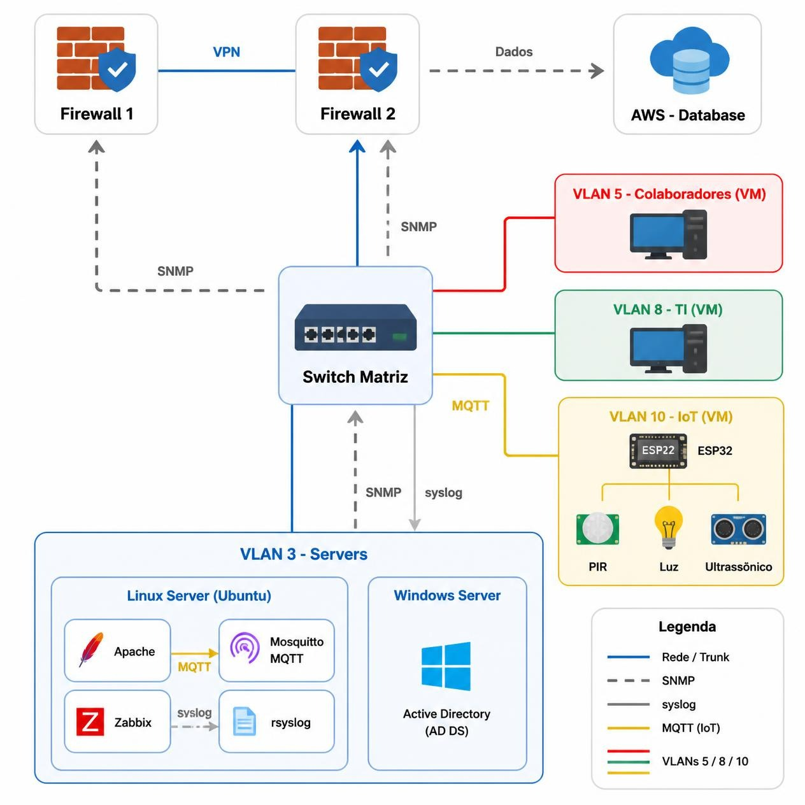

<h1>Projeto Rede de Dados – Tutoria 2026</h1>

<p align="center">
  
  
  
  
  
  
</p>

> Status do projeto: :warning: em desenvolvimento

<details open>
<summary><strong>SUMÁRIO</strong></summary>

:small_blue_diamond: [Descrição do projeto](#descrição-do-projeto)

:small_blue_diamond: [Arquitetura da solução](#arquitetura-da-solução)

:small_blue_diamond: [Endereçamento da rede](#endereçamento-da-rede)

:small_blue_diamond: [Segmentação de rede (VLANs)](#segmentação-de-rede-vlans)

:small_blue_diamond: [Configuração dos firewalls](#configuração-dos-firewalls)

:small_blue_diamond: [Configuração do switch da matriz](#configuração-do-switch-da-matriz)

:small_blue_diamond: [VPNs e redundância em anel](#vpns-e-redundância-em-anel)

:small_blue_diamond: [Sensores e alarme](#sensores-e-alarme)

:small_blue_diamond: [Tarefas em aberto](#tarefas-em-aberto)

</details>

## Descrição do projeto

<p align="justify">
  Projeto desenvolvido na Tutoria 2026, em parceria entre SENAI e CTI, com foco em simular um ambiente corporativo completo composto por matriz, filial e nuvem. A solução foi pensada para aplicar conceitos de redes, segurança e IoT em um contexto real.
</p>

O projeto tem como objetivo demonstrar como uma organização pode:

- segmentar a rede em VLANs por função
- controlar acesso por firewalls
- conectar escritórios por VPNs seguras
- manter redundância para continuidade do serviço
- proteger o ambiente de sensores e dispositivos IoT
- integrar aplicações corporativas com banco de dados em nuvem

## Arquitetura da solução

> Diagrama do prototipo 1.2 - Matriz.

<p align="center">
  
</p>

### Componentes da topologia

| Local | Componentes | Detalhes |
| --- | --- | --- |
| Matriz | Firewall, switch(es), servidor de aplicação, servidor Windows, PCs de colaboradores e TI, sensores | Rede principal da empresa e acesso à nuvem |
| Filial | Firewall, switch, PCs de vendas (5 usuários), sensores | Escritório local com comunicação segura com matriz |
| Nuvem | Banco de dados em AWS/Azure | Infraestrutura centralizada para dados e serviços |

## Endereçamento da rede

### Rede matriz

| Elemento | Endereço |
| --- | --- |
| VLAN3 - Servidores | 10.0.3.0/24 |
| VLAN5 - Colaboradores | 10.0.5.0/24 |
| VLAN8 - TI | 10.0.8.0/24 |
| VLAN10 - IoT | 10.0.10.0/24 |
| Firewall da matriz | 192.168.100.10 |

### Rede filial

| Elemento | Endereço |
| --- | --- |
| VLAN10 - IoT | 10.1.10.0/24 |
| PCs | 10.1.5.0/24 |
| Firewall da filial | 192.168.100.20 |

### Interconexão e infraestrutura de suporte

| Elemento | Endereço |
| --- | --- |
| Firewall do meio | 192.168.100.1 |
| Banco de dados / VPC | 10.1.1.0/24 |

## Segmentação de rede (VLANs)

| VLAN | Finalidade | Quem acessa / regras | Faixa de IP |
| --- | --- | --- | --- |
| VLAN3 | Servidores | Hospeda servidores e aplicações | 10.0.3.0/24 |
| VLAN5 | Colaboradores | Acessa aplicações dos servidores | 10.0.5.0/24 |
| VLAN8 | TI | Acessa servidores e equipamentos de colaboradores por portas pré-definidas | 10.0.8.0/24 |
| VLAN10 | Sensores IoT | Rede isolada, acessível por matriz e filial | 10.0.10.0/24 |

## Configuração dos firewalls

### Firewall da matriz

- Controle de acesso à internet e à nuvem
- Bloqueio de tráfego entre PCs da matriz e da filial
- Liberação das VLANs conforme a regra de segmentação
- Terminação das VPNs da nuvem e da filial
- Saída de internet da filial

| Item | Valor |
| --- | --- |
| Marca / Modelo | A definir |
| IP de gerência | 192.168.100.10 |
| Regras implementadas | ACLs para VLAN3, VLAN5, VLAN8, VLAN10, acesso à internet e VPN |

### Firewall da filial

- Controle de acesso à internet e à nuvem
- Navegação encaminhada pela matriz
- Bloqueio de tráfego entre PCs da filial e da matriz
- Terminação das VPNs da nuvem e da matriz

| Item | Valor |
| --- | --- |
| Marca / Modelo | A definir |
| IP de gerência | 192.168.100.20 |
| Regras implementadas | ACLs para VLAN10, PCs, acesso à matriz e à nuvem via VPN |

## Configuração do switch da matriz

A camada de acesso da matriz foi implementada com Open vSwitch (OVS), permitindo a criação de uma bridge lógica com segmentação por VLANs e integração com o firewall e os serviços internos.

### Topologia utilizada

| Interface | Segmento | VLAN | Função |
| --- | --- | --- | --- |
| ens37 | NAT | - | Acesso externo / internet |
| ens38 | link-fw | trunk | Uplink com o firewall |
| ens39 | vlan3-srv | 3 | Servidores |
| ens40 | vlan5-colab | 5 | Colaboradores |
| ens41 | vlan8-ti | 8 | TI |
| ens42 | vlan10-iot | 10 | Sensores IoT |

### Objetivo

O switch atua como ponto de agregação da rede corporativa, separando o tráfego por função e mantendo o ambiente controlado:

- VLAN 3: servidores
- VLAN 5: colaboradores
- VLAN 8: TI
- VLAN 10: sensores IoT

### Comandos utilizados

```bash
su -

apt update
apt install openvswitch-switch
ovs-vsctl add-br br0

ovs-vsctl add-port br0 ens37
ovs-vsctl add-port br0 ens38 tag=3
ovs-vsctl add-port br0 ens39 tag=5
ovs-vsctl add-port br0 ens40 tag=8
ovs-vsctl add-port br0 ens41 tag=10

for i in ens37 ens38 ens39 ens40 ens41; do
    ip link set $i up
done

cat > /etc/network/interfaces.d/ovs-ports << 'EOF'
auto ens37
iface ens37 inet manual

auto ens38
iface ens38 inet manual

auto ens39
iface ens39 inet manual

auto ens40
iface ens40 inet manual

auto ens41
iface ens41 inet manual
EOF
```

### Explicação da configuração

- `ovs-vsctl add-br br0` cria a bridge lógica do switch.
- `ovs-vsctl add-port br0 ens37` adiciona a interface física ao switch.
- `ovs-vsctl add-port br0 ens38 tag=3` associa a interface à VLAN 3.
- As demais interfaces foram separadas por VLAN:
  - ens39 -> VLAN 5
  - ens40 -> VLAN 8
  - ens41 -> VLAN 10

Essa abordagem permite a criação de um switch virtual multilayer com isolamento lógico entre os segmentos da rede, melhorando a organização, a segurança e o controle de acesso.

### Verificação da funcionalidade

```bash
ovs-vsctl show
ip link show
ovs-vsctl list-ports br0
```

A validação pode ser feita observando se as portas físicas foram integradas ao bridge e se as VLANs foram corretamente associadas às interfaces.

## VPNs e redundância em anel

| Túnel | Origem | Destino | Finalidade | Tipo / Protocolo |
| --- | --- | --- | --- | --- |
| VPN 1 | Matriz | Nuvem | Acesso ao banco de dados | IPsec / site-to-site |
| VPN 2 | Matriz | Filial | Comunicação entre escritórios | IPsec / site-to-site |
| VPN 3 | Filial | Nuvem | Acesso ao banco de dados | IPsec / site-to-site |

### Túneis VPN

- M–F: 172.31.0.0/30
- M–N: 172.31.0.4/30
- F–N: 172.31.0.8/30

O anel interliga matriz, filial e nuvem. Caso um link falhe, a comunicação continua pelo caminho restante.

| Item | Valor |
| --- | --- |
| Protocolo de roteamento / failover | OSPF / roteamento dinâmico com redundância em anel |
| Tempo de convergência | A definir |

## Sensores e alarme

| Sensor | Função | Onde |
| --- | --- | --- |
| PIR | Detecção de movimento | Matriz e filial |
| LDR | Detecção de luminosidade | Matriz e filial |
| Ultrassônico | Detecção de distância / presença | Matriz e filial |

- Os sensores trafegam na VLAN10, separada da rede local
- O alarme é acionado na matriz e na filial quando um sensor detecta evento fora do padrão
- Os sensores são monitorados e os logs são gerenciados

| Item | Valor |
| --- | --- |
| Placa / microcontrolador | A definir |
| Protocolo de comunicação | A definir |
| Ferramenta de monitoramento e logs | A definir |

---

## Desenvolvedores/Contribuintes :octocat:

| [<br><sub>Jully Ferrari</sub>](https://github.com/JullySzztiass) | [<br><sub>Vinícius</sub>](https://github.com/Dedenyee) | [<br><sub>Luane</sub>](https://github.com/gluane) | [<br><sub>Isabelly</sub>](https://github.com/isabellyyvitoria) |
| :---: | :---: | :---: | :---: |
| Documentação | Servidor | Firewall | Firewall |

---

## Licença

The [MIT License]() (MIT)

Copyright :copyright: 2026 - Projeto Rede de Dados (SENAI e CTI)

> Referência: [Preparação pré-projeto](https://miro.com/app/board/uXjVHhTdmiQ=/?share_link_id=182961988823)
