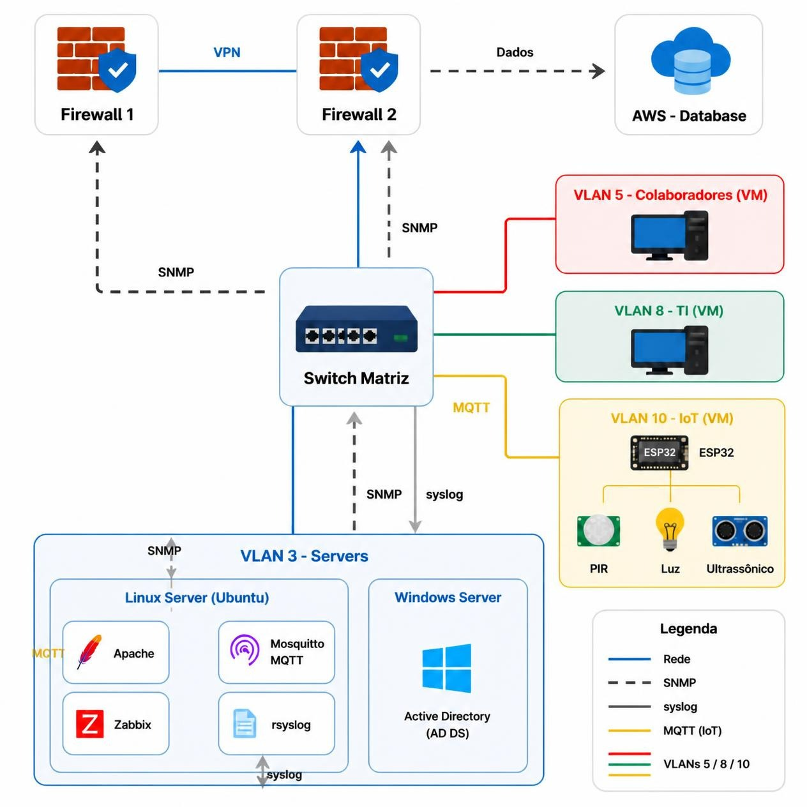

<h1>Projeto Rede de Dados – Tutoria 2026</h1>

  
  
  
  
  
  

> Status do projeto: :warning: em desenvolvimento

<strong>📑 Sumário</strong>

- [Descrição do projeto](#descrição-do-projeto)
- [Arquitetura da solução](#arquitetura-da-solução)
- [Endereçamento da rede](#endereçamento-da-rede)
- [Segmentação de rede (VLANs)](#segmentação-de-rede-vlans)
- [Configuração dos firewalls](#configuração-dos-firewalls)
- [VPNs e redundância em anel](#vpns-e-redundância-em-anel)
- [Sensores e alarme](#sensores-e-alarme)
- [Tarefas em aberto](#tarefas-em-aberto)

## Descrição do projeto

  Projeto desenvolvido na Tutoria 2026, em parceria entre SENAI e CTI, com foco em simular um ambiente corporativo completo composto por matriz, filial e nuvem. A solução foi pensada para aplicar conceitos de segmentação de rede, redundância, segurança e monitoramento de ambientes físicos com sensores IoT.

O projeto tem como objetivo demonstrar como uma organização pode:

- segmentar a rede em VLANs por função
- controlar acesso por firewalls
- conectar escritórios por VPNs seguras
- manter redundância para continuidade do serviço
- proteger o ambiente de sensores e dispositivos IoT
- integrar aplicações corporativas com banco de dados em nuvem

## Arquitetura da solução

> Estrutura geral do ambiente de redes corporativas e IoT.

  

### Componentes da topologia

| Local | Componentes | Detalhes |
| --- | --- | --- |
| Matriz | Firewall, switch(es), servidor de aplicação, servidor Windows, PCs de colaboradores e TI, sensores | Rede principal da empresa e acesso à nuvem |
| Filial | Firewall, switch, PCs de vendas (5 usuários), sensores | Escritório local com comunicação segura com matriz |
| Nuvem | Banco de dados em AWS/Azure | Infraestrutura centralizada para dados e serviços |

## Endereçamento da rede

### Rede matriz

| Elemento | Endereço |
| --- | --- |
| VLAN3 - Servidores | 10.0.3.0/24 |
| VLAN5 - Colaboradores | 10.0.5.0/24 |
| VLAN8 - TI | 10.0.8.0/24 |
| VLAN10 - IoT | 10.0.10.0/24 |
| Firewall da matriz | 192.168.100.10 |

### Rede filial

| Elemento | Endereço |
| --- | --- |
| VLAN10 - IoT | 10.1.10.0/24 |
| PCs | 10.1.5.0/24 |
| Firewall da filial | 192.168.100.20 |

### Interconexão e infraestrutura de suporte

| Elemento | Endereço |
| --- | --- |
| Firewall do meio | 192.168.100.1 |
| Banco de dados / VPC | 10.1.1.0/24 |

## Segmentação de rede (VLANs)

| VLAN | Finalidade | Quem acessa / regras | Faixa de IP |
| --- | --- | --- | --- |
| VLAN3 | Servidores | Hospeda servidores e aplicações | 10.0.3.0/24 |
| VLAN5 | Colaboradores | Acessa aplicações dos servidores | 10.0.5.0/24 |
| VLAN8 | TI | Acessa servidores e equipamentos de colaboradores por portas pré-definidas | 10.0.8.0/24 |
| VLAN10 | Sensores IoT | Rede isolada, acessível por matriz e filial | 10.0.10.0/24 |

## Configuração dos firewalls

### Firewall da matriz

- Controle de acesso à internet e à nuvem
- Bloqueio de tráfego entre PCs da matriz e da filial
- Liberação das VLANs conforme a regra de segmentação
- Terminação das VPNs da nuvem e da filial
- Saída de internet da filial

| Item | Valor |
| --- | --- |
| Marca / Modelo | A definir |
| IP de gerência | 192.168.100.10 |
| Regras implementadas | ACLs para VLAN3, VLAN5, VLAN8, VLAN10, acesso à internet e VPN |

### Firewall da filial

- Controle de acesso à internet e à nuvem
- Navegação encaminhada pela matriz
- Bloqueio de tráfego entre PCs da filial e da matriz
- Terminação das VPNs da nuvem e da matriz

| Item | Valor |
| --- | --- |
| Marca / Modelo | A definir |
| IP de gerência | 192.168.100.20 |
| Regras implementadas | ACLs para VLAN10, PCs, acesso à matriz e à nuvem via VPN |

## VPNs e redundância em anel

| Túnel | Origem | Destino | Finalidade | Tipo / Protocolo |
| --- | --- | --- | --- | --- |
| VPN 1 | Matriz | Nuvem | Acesso ao banco de dados | IPsec / site-to-site |
| VPN 2 | Matriz | Filial | Comunicação entre escritórios | IPsec / site-to-site |
| VPN 3 | Filial | Nuvem | Acesso ao banco de dados | IPsec / site-to-site |

### Túneis VPN

- M–F: 172.31.0.0/30
- M–N: 172.31.0.4/30
- F–N: 172.31.0.8/30

O anel interliga matriz, filial e nuvem. Caso um link falhe, a comunicação continua pelo caminho restante.

| Item | Valor |
| --- | --- |
| Protocolo de roteamento / failover | OSPF / roteamento dinâmico com redundância em anel |
| Tempo de convergência | A definir |

## Sensores e alarme

| Sensor | Função | Onde |
| --- | --- | --- |
| PIR | Detecção de movimento | Matriz e filial |
| LDR | Detecção de luminosidade | Matriz e filial |
| Ultrassônico | Detecção de distância / presença | Matriz e filial |

- Os sensores trafegam na VLAN10, separada da rede local
- O alarme é acionado na matriz e na filial quando um sensor detecta evento fora do padrão
- Os sensores são monitorados e os logs são gerenciados

| Item | Valor |
| --- | --- |
| Placa / microcontrolador | A definir |
| Protocolo de comunicação | A definir |
| Ferramenta de monitoramento e logs | A definir |

## Tarefas em aberto

- :memo: Documentar a topologia da rede
- :memo: Documentar as configurações dos firewalls da matriz e da filial
- :memo: Documentar as VLANs 3, 5, 8 e 10 e quem acessa cada uma
- :memo: Documentar as VPNs e o anel de redundância
- :memo: Documentar a aplicação e o banco de dados na nuvem
- :memo: Documentar os sensores e o alarme
- :memo: Configurar SSO e dupla autenticação

---

## Desenvolvedores/Contribuintes :octocat:

| [ Jully Ferrari](https://github.com/JullySzztiass) |
| :---: |

---

## Licença

The [MIT License]() (MIT)

Copyright :copyright: 2026 - Projeto Rede de Dados (SENAI e CTI)
